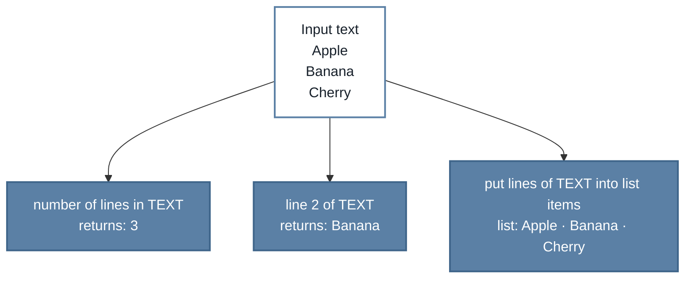

# Text Lines for TurboWarp

Use multiline text in TurboWarp projects. Text Lines adds three blocks that can:

- count the lines in some text;
- return one line by its position; and
- replace a Scratch list with every line from the text.

**User guide:** [English](https://kubohiroya.github.io/turbowarp-text-lines/) · [日本語](https://kubohiroya.github.io/turbowarp-text-lines/ja/)

## Quick start

1. Download [`dist/text-lines.js`](dist/text-lines.js?raw=1).
2. In **TurboWarp Desktop**, open **Extensions**, choose **Custom Extension**, and load the downloaded file.
3. Enable **Run extension without sandbox** when TurboWarp asks.

> [!IMPORTANT]
> Text Lines needs to run without the sandbox because its command block writes directly to Scratch lists.

The ready-to-use JavaScript file is committed to this repository. You do not need Node.js to install the extension.

## See it in action

Start with this text:

```text
Apple
Banana
Cherry
```

Each block uses the same text in a different way:



The two rounded reporter blocks return a value. The command block changes the selected list immediately.

## Block reference

### Which block should I use?

| Goal | Block | Result for the example above |
|---|---|---|
| Count all lines | `number of lines in [TEXT]` | `3` |
| Read one line | `line [LINE] of [TEXT]` with line `2` | `Banana` |
| Turn the text into list items | `put lines of [TEXT] into list [LIST]` | `Apple`, `Banana`, `Cherry` |

The exact block definitions are generated from [`src/block-definitions.json`](src/block-definitions.json):

<!-- BEGIN GENERATED BLOCKS -->

### `number of lines in [TEXT]`

Returns the number of lines in the supplied text.

<details>
<summary>Block metadata</summary>

| Property | Value |
|---|---|
| Type | Reporter |
| Opcode | `lineCount` |
| `TEXT` | String, default: `first line\nsecond line` |

</details>

### `line [LINE] of [TEXT]`

Returns one line using a one-based line number. Invalid line numbers return an empty string.

<details>
<summary>Block metadata</summary>

| Property | Value |
|---|---|
| Type | Reporter |
| Opcode | `lineAt` |
| `TEXT` | String, default: `first line\nsecond line` |
| `LINE` | Number, default: `1` |

</details>

### `put lines of [TEXT] into list [LIST]`

Replaces the contents of the named Scratch list with the lines of the supplied text.

<details>
<summary>Block metadata</summary>

| Property | Value |
|---|---|
| Type | Command |
| Opcode | `writeLinesToList` |
| `TEXT` | String, default: `first line\nsecond line` |
| `LIST` | String, menu: `LIST_MENU` |

</details>

<!-- END GENERATED BLOCKS -->

## Important behavior

| Situation | What Text Lines does |
|---|---|
| Line numbers | Starts counting at `1`, not `0` |
| Invalid line number | Returns an empty string |
| Empty text | Treats it as one empty line |
| Text ending with a line break | Adds an empty final line |
| List command | Replaces all existing items in the selected list |
| Line endings | Accepts LF (`\n`), CRLF (`\r\n`), and CR (`\r`) |

> [!WARNING]
> Copy any list contents you need to keep before running the list command.

For illustrated examples and the Japanese version, open the [complete user guide](https://kubohiroya.github.io/turbowarp-text-lines/).

## Development

Install dependencies and run every check:

```bash
npm install
npm run check
```

Useful commands:

| Command | Purpose |
|---|---|
| `npm run dev` | Rebuild the extension while files change |
| `npm run test` | Run the test suite once |
| `npm run typecheck` | Check TypeScript types |
| `npm run build` | Build `dist/text-lines.js` |
| `npm run docs` | Regenerate the block reference from the canonical definitions |

When extension source changes, rebuild and commit [`dist/text-lines.js`](dist/text-lines.js). When block definitions change, run `npm run docs` before committing.

## License

[MPL-2.0](LICENSE)
